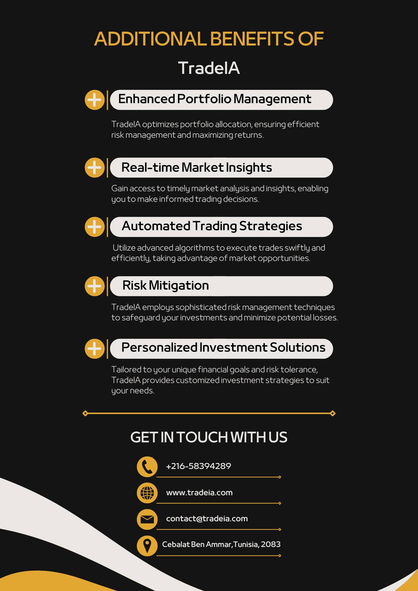

# TradeIA: Dominating Markets with Reptilian Precision

## Project Overview

TradeIA is an intelligent trading agent designed to help asset managers make informed investment decisions. Inspired by the epic battle between Godzilla and King Kong, TradeIA represents a powerful force (Godzilla) navigating the complexities of the financial market (King Kong). This project was developed as part of an integrated project (PFA) in data science, in collaboration with ESPRIT university and VALUE company.

## Project Objectives

- Develop an intelligent trading agent that leverages machine learning and deep learning techniques to optimize trading strategies.
- Assist asset managers in making data-driven investment decisions.
- Implement a comprehensive approach to data understanding, model development, and risk portfolio optimization.

## Project Development Pipeline

The project followed the Team Data Science Process (TDSP), which includes the following steps:

1. **Business Understanding**: Identifying the objectives and requirements of the trading agent for asset managers.
2. **Data Acquisition and Understanding**: Collecting and preprocessing financial data to gain insights into market trends.
3. **Modeling**: Developing and training models to predict market movements and optimize trading strategies.
4. **Deployment**: Implementing the trading agent in a real-world environment and monitoring its performance.
5. **Conclusion and Perspective**: Evaluating the project's success and identifying areas for future improvement.

## Key Features and Benefits

- **Predictive Modeling**: Utilizes advanced machine learning algorithms to forecast market trends.
- **Risk Management**: Implements robust risk portfolio optimization techniques.
- **User-Friendly Interface**: Designed with asset managers in mind, providing intuitive and actionable insights.
- **Adaptability**: Capable of adapting to changing market conditions for sustained performance.

## Challenges in the Tunisian Market

The Tunisian financial market faces several challenges that impact trading activities:

1. **Market Liquidity**: Limited market liquidity can lead to higher volatility and difficulty in executing large trades without affecting market prices.
2. **Regulatory Environment**: Navigating the complex regulatory landscape requires a deep understanding of local laws and regulations.
3. **Economic Stability**: Economic fluctuations and political instability can create an unpredictable trading environment.
4. **Access to Data**: Limited access to comprehensive and high-quality financial data can hinder effective analysis and decision-making.
5. **Technological Infrastructure**: The need for advanced technological infrastructure to support sophisticated trading algorithms and real-time data processing.

## Acknowledgments

We would like to thank our tutors, Bilel FARAH, Feres, and Wiem TRABELSI, for their guidance and support throughout this project. Special thanks to Ahmed Rbaii, Responsable de metier of VALUE Company, for his invaluable contributions. We also extend our gratitude to our team, DIVE (Data Insights & Visualizations Engineers), for their dedication and hard work.

## Contact Information

For more information about TradeIA, please contact:

- **[Nermine Ourimi]**
- **[nermine.lourimi@gmail.com]**
- **[https://www.linkedin.com/in/nermine-ourimi-5515b7174/]**

## Acknowledgments
I would like to extend my gratitude to my team, DIVE (Data Insights & Visualizations Engineers), for their dedication and hard work:
Yousri Hamdene, Nermine Haouala , Ons Dekhil , Yahya Amri, Malek Zitouni and Sarah Aissaoui

